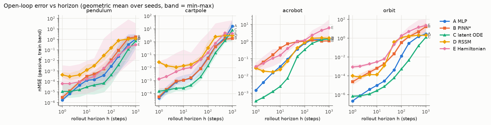
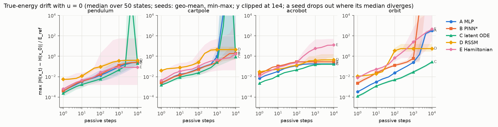
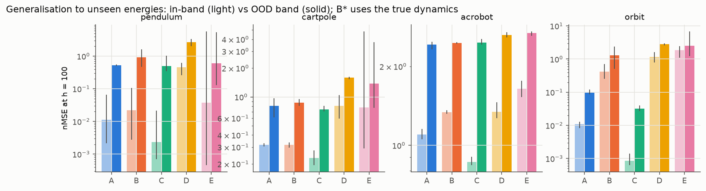
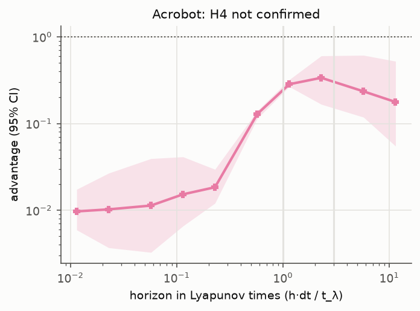

# hamiltonian-world-models

Action-conditioned world models whose structure (a learned Hamiltonian, port-Hamiltonian control and
damping, and a symplectic integrator) guarantees energy conservation in the absence of control. They
work from state vectors and from 64×64 pixels and are used for model-predictive control.

**Question.** Does building physics into a world model's *structure* beat learning it through a *loss*,
on long-horizon accuracy, generalisation to unseen energies, and sample-efficient control? And where does
the advantage stop on a chaotic system?

The hypotheses, metrics and decision rules were frozen in [`PREREGISTRATION.md`](PREREGISTRATION.md)
before any model code existed; [`results/verdicts.md`](results/verdicts.md) applies them mechanically.
Read [`LIMITATIONS.md`](LIMITATIONS.md) alongside the results.

## Method

| id | model | idea |
|---|---|---|
| A | MLP | residual next-state predictor |
| B | PINN* | A + residual against the true equations of motion (*privileged) |
| C | latent Neural ODE | RK4 latent dynamics + energy penalty: physics through the **loss** |
| D | RSSM | Dreamer-style recurrent state-space model |
| E | **Hamiltonian world model** | latent (q, p), H = ½ pᵀA(q)p + V(q) with A ≻ 0 by construction, input G(q)u and damping R(q) ⪰ 0, Strang splitting around a symplectic step: physics through the **structure** |
| E-ens | 5 × E | bootstrapped ensemble; its disagreement is penalised by the planner |

Four ground-truth systems with exactly known energy, simulated with a 4th-order Gauss–Legendre
integrator (relative energy drift < 1e-5 over 10k steps): pendulum (torque), cart-pole (force), acrobot
(elbow torque, chaotic) and the planar two-body orbit (thrust). Models train on a low energy band and are
tested in-band and on a disjoint higher band.

| hypothesis | pre-registered test |
|---|---|
| H1 | E's true-energy drift over 10k passive steps is ≥ 10× lower than C's (CI lower bound > 3) on ≥ 2 of 3 systems |
| H2 | E has lower out-of-band error at 100 steps than every baseline on ≥ 3 of 4 systems |
| H3 | with pixels, MPC with E-ens reaches 80% task success with ≤ ½ the env steps of the RSSM on ≥ 2 of 3 tasks |
| H4 | on the acrobot the advantage holds within one Lyapunov time and is gone beyond three |

## Results (state vectors: H1, H2, H4)

**None of the pre-registered hypotheses tested so far is supported.** 60 runs (5 models × 4 systems ×
3 seeds); full tables with per-seed values and 95% bootstrap CIs in
[`results/verdicts.md`](results/verdicts.md). Model E is the version after
[amendment 1](PREREGISTRATION.md#amendments) (stability fixes made before any verdict existed).

| hypothesis | verdict | in one line |
|---|---|---|
| H1 energy drift ≥ 10× below C | **not supported** (0 of 3 systems) | pendulum and cart-pole fail on one bad seed of E each; on the orbit E drifts far more than C on every seed |
| H2 lower out-of-band error than every baseline | **not supported** (0 of 4) | E never beats all four baselines; on the acrobot every baseline beats it |
| H3 sample-efficient control (pixels) | not run yet | the pre-registered protocol needs months of compute here; a reduced protocol will be added as amendment 2 |
| H4 advantage within 1 Lyapunov time, gone beyond 3 | **not confirmed** | on the acrobot E is worse than the best baseline at every horizon (advantage 0.01–0.3) |

**What the runs show.** E does what its structure promises — it conserves *its own* learned energy
(learned-H drift 1e-5 to 1e-2 over 10,000 steps in 11 of 12 runs) — but conserving the learned energy is
not conserving the true one. When a seed fits the system well, the true-energy drift is the lowest of any
model: pendulum seeds 0 and 2 drift 0.002–0.006 (C: 0.15–0.27, and C's rollouts diverge on one seed),
cart-pole seeds 0 and 1 drift 0.045 (baselines 0.6–2.9). When the learned H is off away from the data,
the latent trajectory keeps H_θ fixed while sliding into regions that decode to states with the wrong
energy: pendulum seed 1 (drift 58), cart-pole seed 2 (2,400), and all three orbit seeds (37 to 14,000).
With three seeds the pre-registered CI lower bound is the worst seed, so one such seed fails a system.
E also pays for its 2n-dimensional canonical bottleneck at short horizons: its one-step error is 10–1000×
higher than the baselines' on every system (figure below), and it rarely wins that back later.






## Reproduce

```bash
uv sync
uv run pytest                                            # unit tests, CPU, < 2 min
uv run pytest -m slow                                    # 10k-step conservation checks

uv run python scripts/gen_data.py --config configs/data/{pendulum,cartpole,acrobot,orbit}.yaml
uv run python scripts/sweep.py configs/sweeps/state.yaml --shard 0/1   # H1, H2: 60 runs
uv run python scripts/lyapunov.py --env acrobot                         # H4
uv run python scripts/run_mbrl.py --config configs/model/ensemble.yaml env=pendulum obs_mode=pixels  # H3
uv run python scripts/make_figures.py                                   # verdicts.md + figures
```

One run: `uv run python scripts/train.py --config configs/model/hamiltonian.yaml env=acrobot seed=1`, then
`uv run python scripts/evaluate.py results/acrobot-hamiltonian-state-s1`. Every run writes its resolved
config, metrics and checkpoints under `results/<env>-<model>-<obs>-s<seed>/` and resumes if interrupted.
Hardware: one RTX 4060 Laptop GPU (8 GB); every model is under 5M parameters.

## Layout

```
hwm/envs         simulators, rewards, success predicates, 64×64 SDF renderer
hwm/integrators  GL4 (ground truth), rk4 / leapfrog / implicit midpoint (models)
hwm/data         dataset generation (energy bands, OU actions), training windows
hwm/models       A-E, ensemble, shared contract
hwm/train        the shared trainer
hwm/planning     CEM, MPC, model-based RL loop
hwm/eval         rollout error, energy drift, statistics, calibration, Lyapunov, verdicts, figures
scripts/         gen_data, train, evaluate, sweep, run_mbrl, lyapunov, make_figures
```

## License

MIT. See [LICENSE](LICENSE). Copyright (c) 2026 Shushant Kumar Choudhary.
